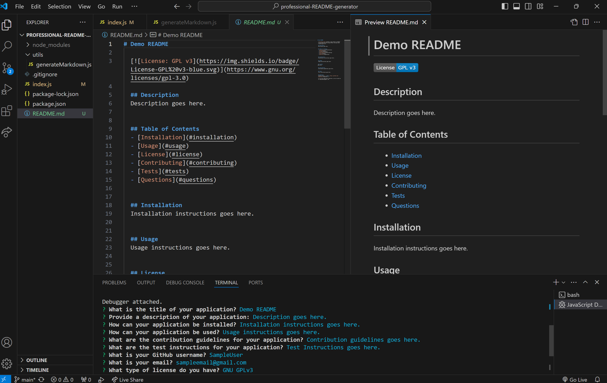

# Professional README Generator

## Description

The purpose of this project was to create a command-line application that can generate a professional README. This allows a developer to quickly have a README generated for them so they can focus more time on developing their project and less time on creating the README. By creating this project I was able to further my knowledge of node.js as well as implement the use of an inquirer npm package, which prompts the developer for their input.

## Usage

This application can be used by invoking "npm start" within the command line. This will then prompt the user to input details regarding their project with the use of the inquirer package. For instance, they are asked for the title, a description, the installation process for their application, how it can be used, and other questions regarding their project. The user is also asked for their Github username and email in order to be contacted. After inputting all this information, the user is then able to have a README.md file generated. 

